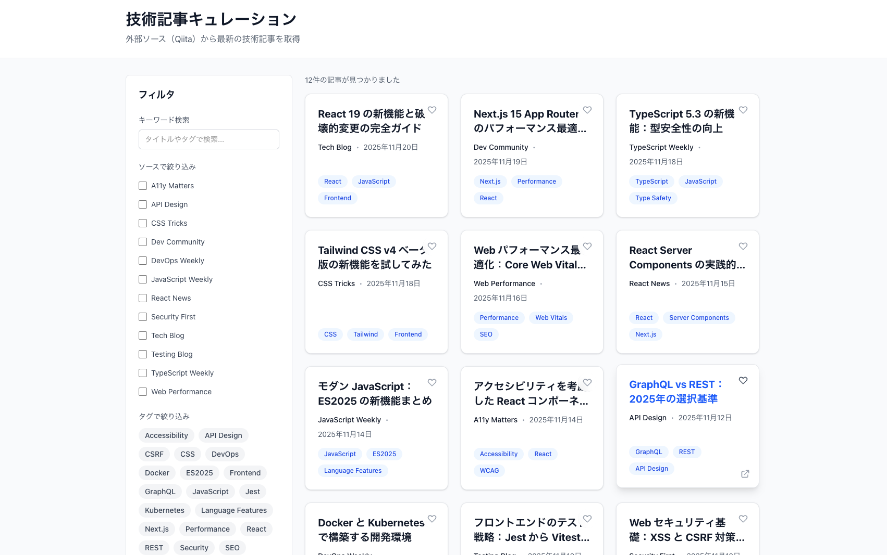

# News Curator – 技術記事キュレーションアプリ

最新の技術記事をカード形式で一覧・閲覧できる、フロントエンド特化のキュレーションアプリケーションです。


**🔗 デモ**: [https://news-curator-zeta.vercel.app/](https://news-curator-zeta.vercel.app/)




## 概要
AI・Web技術・スタートアップなど、興味のある分野の最新記事をまとめて閲覧できるサービスです。  
「毎朝ニュースを巡回する手間を減らす」「必要な情報だけ効率よく取りに行く」ことを目的に開発しています。

---

## 技術選定理由

| 分野 | 技術 | 選定理由 |
|------|------|----------|
| **Frontend** | Next.js 16 (App Router)<br>React<br>TypeScript | Server Components による効率的なデータ取得と、長期運用での責務分離のしやすさを評価。<br>型安全性により、UI が複雑になっても安心してリファクタできる基盤を構築。 |
| **Styling** | Tailwind CSS v4 | 高速かつ整った UI を実装でき、デザイン調整にも柔軟に対応できる点を重視。 |
| **Package Manager** | pnpm | パッケージ管理が高速かつ安定しており、日々の開発ストレスを減らせるため採用。 |
| **Testing** | Vitest<br>React Testing Library | Next.js と相性が良く、ユーザー視点の UI テストを自然に書ける環境を重視して採用。 |

---


## 機能（Features）

### 主な機能
- **Qiita API 連携**: Qiita REST API v2 を利用して最新記事を取得
- **リッチな情報表示**: 記事の「いいね数」「ストック数」を表示して人気度を可視化
- **タグフィルタリング**: 興味のある技術タグ（React, Next.js等）で記事を絞り込み
- **レスポンシブ UI**: PC・スマホ問わず快適に閲覧できるカード型レイアウト
- **お気に入り機能**: 気になる記事を一時的に保存（ローカルステート）

### 今後の拡張予定

- 記事検索（キーワード検索）
- タグによるフィルタリング
- お気に入り（Bookmark）機能
- 外部API（News API / RSS等）との統合
- ページネーション / ソート（公開日／人気順など）
- ダークモード対応


### 設計上のポイント

- `app/` 配下で **ページ・レイアウト・UIコンポーネント・データ・型定義を明確に分離**
- `app/types/` に Article 型などを定義し、Card/List コンポーネント間で共有
- Qiita API からデータを取得し、将来的な他の外部API統合（News API / RSS など）にも対応できるよう、  
  データ取得ロジックを `app/lib/fetchers/` に分離した拡張しやすい構造

---

## プロジェクト構造（Project Structure）

```
news-curator/
├── app/
│   ├── articles/
│   │   └── [id]/
│   │       └── page.tsx          # 記事詳細ページ（動的ルーティング）
│   ├── components/
│   │   ├── ArticleCard.tsx       # 記事カードコンポーネント
│   │   ├── ArticleList.tsx       # 記事一覧コンポーネント
│   │   └── Header.tsx            # ヘッダーコンポーネント
│   ├── lib/
│   │   └── fetchers/
│   │       ├── qiita-api.ts      # Qiita REST API フェッチャー（v2）
│   │       └── types.ts          # フェッチャー共通型定義
│   ├── types/
│   │   └── types.ts              # TypeScript型定義
│   ├── globals.css               # グローバルスタイル
│   ├── layout.tsx                # ルートレイアウト
│   └── page.tsx                  # トップページ（記事一覧）
├── public/                       # 静的ファイル
└── docs/                         # ドキュメント
    ├── API_INTEGRATION.md        # API統合ガイド
    └── filter-cases.md           # フィルタリング仕様
```

---

## セットアップ（Setup）

### 前提条件

- Node.js 18.x 以上
- pnpm（推奨）または npm

### インストール

```bash
# リポジトリをクローン
git clone <repository-url>
cd news-curator

# 依存関係のインストール
pnpm install
```

### 開発サーバーの起動

```bash
pnpm dev
```

ブラウザで [http://localhost:3000](http://localhost:3000) を開いてアプリケーションを確認できます。

### ビルド

```bash
# プロダクションビルド
pnpm build

# ビルドしたアプリケーションの起動
pnpm start
```

### Lint / フォーマット

```bash
# ESLint チェック
pnpm lint

# 型チェック
pnpm type-check
```

---

## 開発ガイドライン（Development Guidelines）

### コーディング規約

- **TypeScript**: `any` 禁止、すべての関数に戻り値の型を明示
- **React**: コンポーネントは単一責任、Props は必ず型定義
- **Next.js**: Server Component をデフォルト、Client Component は必要な場合のみ
- **Tailwind CSS**: クラス名の順序を統一（レイアウト → サイズ → スペーシング → 色）

### コミット規約

Conventional Commits 形式を採用:

```
feat: 新機能追加
fix: バグ修正
docs: ドキュメント更新
refactor: リファクタリング
style: コードフォーマット
test: テスト追加・修正
```

---

## ドキュメント（Documentation）

- [API統合ガイド](./docs/api-integration.md) - 外部API統合の手順
- [フィルタリング仕様](./docs/filter-cases.md) - タグフィルタリングの実装仕様

---

## 工夫した点（Key Highlights）

### 1. Qiita RSS から API v2 への移行と設計判断
初期開発フェーズでは認証不要な RSS フィードを採用しましたが、以下の課題に直面し API v2 への移行を決断しました。
- **課題**: RSS フィードでは「タグ情報」が正確に取得できず、フィルタリング機能の実装が困難だった。また、「いいね数」が取得できず、記事の人気度がわからなかった。
- **解決策**: Qiita API (REST) を採用し、タグ配列や `likes_count` を取得するように変更。
- **工夫**: API 移行を見越してデータフェッチ層を `fetchers/` ディレクトリに分離し、インターフェース (`ArticleFetcher`) を定義していたため、呼び出し元のコンポーネントを修正することなくスムーズに移行できました。

### 2. 型安全性と拡張性
- API レスポンスの型 (`ExternalArticle`) と、UI コンポーネントで扱う型 (`Article`) を明確に区別して定義しました。
- これにより、将来 Zenn や TechFeed など他のソースを追加した際も、UI 側のコードを変更せずにデータ変換層だけで対応できる設計になっています。

### 3. パフォーマンス最適化
- **Server Components**: 記事データ取得をサーバーサイドで行い、クライアントへのJS転送量を削減。
- **キャッシュ戦略**: API ルートで `revalidate: 300` (5分) を設定し、Qiita API のレート制限 (60回/時) を回避しつつ、高速なレスポンスを実現しました。

---

## 謝辞（Acknowledgments）

- [Next.js](https://nextjs.org/)
- [Tailwind CSS](https://tailwindcss.com/)
- [TypeScript](https://www.typescriptlang.org/)
