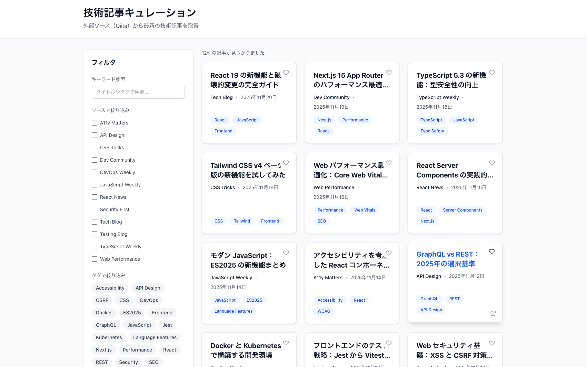

# Tech Feed – 技術フィード

Qiita と Hacker News の最新技術記事を一覧・閲覧できるキュレーションアプリケーションです。

**🔗 デモ**: [https://tech-feed-zeta.vercel.app/](https://tech-feed-zeta.vercel.app/)

### デスクトップ版


## 概要
エンジニアとして興味のある分野の技術情報を効率よく収集したいという自身の課題から開発した個人プロジェクトです。

元々は自分用のツールとして作成し、UX認定の学習で得た手法（ペルソナ設計・Problem Statement・User Journey Map）を適用して改善を進めています。
詳細は [ペルソナ & User Journey Map](./docs/ux/persona.md) を参照してください。

---

## 技術選定理由

| 分野 | 技術 | 選定理由 |
|------|------|----------|
| **Frontend** | Next.js 16 (App Router)<br>React 19<br>TypeScript | Server Components による効率的なデータ取得と、長期運用での責務分離のしやすさを評価。<br>型安全性により、UI が複雑になっても安心してリファクタできる基盤を構築。 |
| **Styling** | Tailwind CSS v4 | 高速かつ整った UI を実装でき、デザイン調整にも柔軟に対応できる点を重視。 |
| **Cache / DB** | Upstash Redis | サーバーレス環境で動作するRedis互換KVストア。記事キャッシュと翻訳キャッシュに使用。 |
| **Translation** | Google Cloud Translation API | Hacker News の英語記事タイトルを自動翻訳。結果はRedisにキャッシュして効率化。 |
| **Package Manager** | pnpm | パッケージ管理が高速かつ安定しており、日々の開発ストレスを減らせるため採用。 |
| **Testing** | Vitest<br>React Testing Library<br>Playwright | Next.js と相性が良く、ユーザー視点の UI テストを自然に書ける環境を重視して採用。 |

---


## 機能（Features）

### 実装済み機能
- **マルチソース対応**: Qiita API v2 と Hacker News API から記事を取得
- **ソース切り替えタブ**: Qiita / Hacker News / All の切り替え表示
- **カテゴリ選択によるパーソナライズ**: フロントエンド、バックエンド、AI/ML、インフラなど7つのカテゴリから選択
- **Hacker News 記事の自動翻訳**: 英語タイトルを日本語に自動翻訳（Google Translation API）
- **Upstash Redis によるキャッシュ**: 記事データと翻訳結果をキャッシュして高速化
- **リッチな情報表示**: 記事の「いいね数」「ストック数」「スコア」「コメント数」を表示
- **注目記事（PICK UP!）**: 特に注目すべき記事をハイライト表示
- **ダークモード**: ワンクリックでライト/ダークテーマを切り替え
- **レスポンシブ UI**: PC・スマホ問わず快適に閲覧できるカード型レイアウト
- **お気に入り機能**: 記事をお気に入りに保存し、ダッシュボードで一覧表示
- **ダッシュボード**: お気に入り記事の管理画面（読書統計・連続学習記録は現在モックデータで表示）
- **包括的なテスト**: Vitest、React Testing Library、Playwrightによるユニット・E2Eテスト
- **Storybook**: コンポーネントの開発・ドキュメント環境
- **充実したUIフィードバック**: ローディング、エラー、空状態の適切な表示

---

## プロジェクト構造（Project Structure）

```
app/
├── (feed)/                  # フィード画面（ルートグループ）
├── dashboard/               # ダッシュボード画面
├── api/                     # APIルート（薄いController層）
├── components/
│   ├── ui/                  # 汎用UIパーツ（Badge, Modal等）
│   ├── feed/                # フィード関連 + __tests__/ + stories/
│   ├── dashboard/           # ダッシュボード関連 + __tests__/ + stories/
│   └── layout/              # 共有レイアウト + __tests__/ + stories/
├── lib/
│   ├── fetchers/            # データ取得（Fetcherパターン）
│   ├── cache/               # Upstash Redis キャッシュ管理
│   ├── services/            # ビジネスロジック（Service層）
│   └── hooks/               # カスタムフック
├── types/                   # 共通型定義（BaseArticle, Article等）
└── globals.css
e2e/                         # E2Eテスト（Playwright）
.storybook/                  # Storybook設定
docs/                        # ドキュメント
```

---

## セットアップ（Setup）

### 前提条件

- Node.js 20.x 以上
- pnpm（推奨）または npm

### 環境変数

`.env.local` ファイルを作成し、以下の環境変数を設定してください。

```bash
# Qiita API（任意: 設定するとレート制限が緩和される）
QIITA_ACCESS_TOKEN=your_qiita_token

# Upstash Redis（任意: 記事キャッシュ・翻訳キャッシュに使用）
KV_REST_API_URL=your_upstash_redis_url
KV_REST_API_TOKEN=your_upstash_redis_token

# Google Cloud Translation API（任意: Hacker News記事の翻訳に使用）
GOOGLE_TRANSLATE_API_KEY=your_google_api_key
```

> **Note**: 環境変数が設定されていない場合も動作しますが、一部機能が制限されます。

### インストール

```bash
# リポジトリをクローン
git clone <repository-url>
cd tech-feed

# 依存関係のインストール
pnpm install
```

### 開発サーバーの起動

```bash
pnpm dev
```

ブラウザで [http://localhost:3000](http://localhost:3000) を開いてアプリケーションを確認できます。

### ビルド

```bash
# プロダクションビルド
pnpm build

# ビルドしたアプリケーションの起動
pnpm start
```

### Lint / フォーマット

```bash
# ESLint チェック
pnpm lint

# 型チェック
pnpm type-check
```

### テスト

```bash
# ユニットテストの実行
pnpm test

# テストをUIモードで実行
pnpm test:ui

# テストカバレッジの確認
pnpm test:coverage

# E2Eテストの実行
pnpm test:e2e

# E2EテストをUIモードで実行
pnpm test:e2e:ui
```

### Storybook

```bash
# コンポーネントカタログの起動
pnpm storybook

# Storybookのビルド
pnpm build-storybook
```

---

## 開発ワークフロー（Development Workflow）

### CI/CD
GitHub Actions で以下を自動実行：
- **ESLint** によるコード品質チェック
- **TypeScript** の型チェック
- **Vitest + Playwright** によるテスト

詳細: [`.github/workflows/ci.yml`](.github/workflows/ci.yml)

---

## 開発ガイドライン（Development Guidelines）

### コーディング規約

- **TypeScript**: `any` 禁止、すべての関数に戻り値の型を明示
- **React**: コンポーネントは単一責任、Props は必ず型定義
- **Next.js**: Server Component をデフォルト、Client Component は必要な場合のみ
- **Tailwind CSS**: クラス名の順序を統一（レイアウト → サイズ → スペーシング → 色）

### コミット規約

Conventional Commits 形式を採用:

```
feat: 新機能追加
fix: バグ修正
docs: ドキュメント更新
refactor: リファクタリング
style: コードフォーマット
test: テスト追加・修正
```

---

---

## 工夫した点（Key Highlights）

### 1. マルチソース対応とフェッチャーパターン
データフェッチ層を `app/lib/fetchers/` に分離し、`ArticleFetcher` インターフェースを定義。
- **Qiita API v2**: タグ情報や「いいね数」を取得
- **Hacker News API**: 公式 Firebase API を使用してトップストーリーを取得
- 新しいデータソースを追加する際は、フェッチャーを追加するだけで対応可能な設計

### 2. 型安全性と拡張性
- 共通フィールドを `BaseArticle` に集約し、`Article`（クライアント側）と `ExternalArticle`（サーバー側）が継承する設計
- 各ソースの特性（Qiita の「いいね数」、Hacker News の「スコア」など）を統一的に扱える設計

### 3. Upstash Redis によるキャッシュ戦略
- **記事キャッシュ**: 取得した記事を25時間キャッシュし、API レート制限を回避
- **翻訳キャッシュ**: Google Translation API の結果を30日間キャッシュしてコストを最適化
- Redis未設定時は自動的にフォールバック動作

### 4. Hacker News 記事の自動翻訳
- 英語タイトルを Google Cloud Translation API で日本語に自動翻訳
- 翻訳結果は Redis にキャッシュして API コールを最小化
- キャッシュ保存時に翻訳済みデータを含めることで、2回目以降の読み込みを高速化

### 5. カテゴリベースのパーソナライズ
- 7つのカテゴリ（フロントエンド、バックエンド、AI/ML、インフラ、モバイル、セキュリティ、トレンド）を定義
- 各カテゴリに関連タグを紐付け、選択したカテゴリに基づいて記事をフィルタリング
- 設定は LocalStorage に保存し、次回訪問時も維持

### 6. Service Object パターンによる責務分離
- `route.ts`（234行）が肥大化したため、ビジネスロジックを `articleService.ts` に分離し55行に削減
- HTTP層とロジック層を分けたことで、Server Componentsからも直接呼び出せる再利用性を確保
- TechFeed（259行）も `useArticleFetch` + `useArticleFilter` に分割し、テスト容易性を向上

### 7. CI/CD による品質担保
- **GitHub Actions**: main/develop ブランチへのプッシュ・PR時に Lint・型チェック・テストを自動実行
- Vercel との連携により、CI が成功したコードのみデプロイされる仕組みを構築

---

## 謝辞（Acknowledgments）

- [Next.js](https://nextjs.org/)
- [Tailwind CSS](https://tailwindcss.com/)
- [TypeScript](https://www.typescriptlang.org/)
- [Upstash](https://upstash.com/)
- [Qiita API](https://qiita.com/api/v2/docs)
- [Hacker News API](https://github.com/HackerNews/API)
